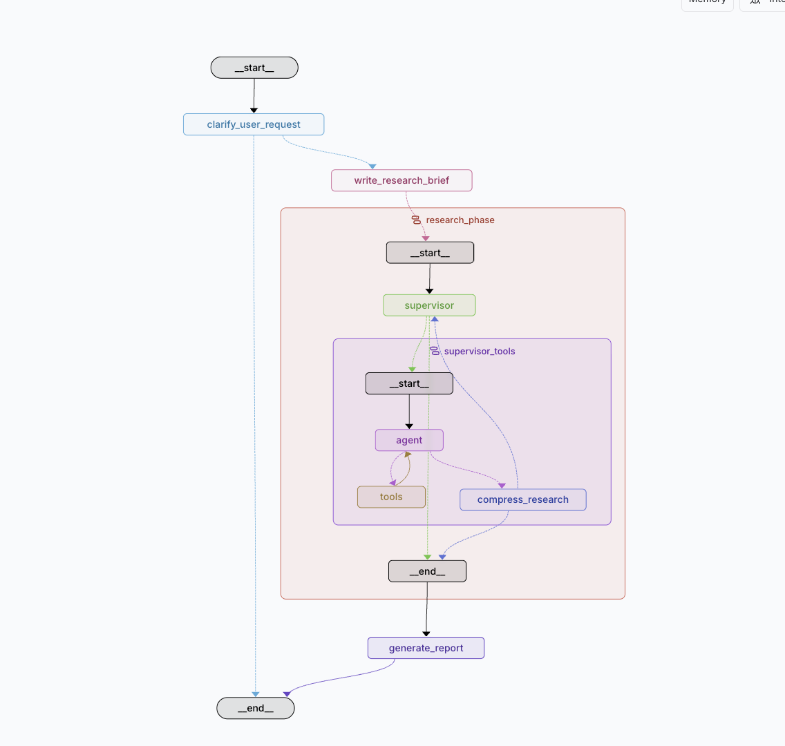

## LangGraph Deep Research

Deep research has broken out as one of the most popular agent applications. OpenAI, Anthropic, Perplexity and Google all have a deep research to produce comprehensive report

Built with LangGraph, this Deep research system orchestrates multiple specialized agents to conduct comprehensive research on complex topics. The system features a supervisor agent that coordinates parallel research activities using specialized research agents equipped with web search capabilities.



### Features

The system operates through three distinct phases:

#### 🔍 **Scoping Phase** - Gather User Context

- **Intelligent Clarification**: Analyzes user requests and asks targeted questions to refine research scope
- **Context Gathering**: Understands user needs, requirements, and expectations for the research
- **Scope Definition**: Transforms conversations into detailed research briefs with clear objectives

#### 🔬 **Research Phase** - Gather Comprehensive Information

- **Adaptive Research Strategy**: Automatically determines whether to conduct parallel or sequential research based on topic complexity
- **Multi-Agent Coordination**: Supervisor agent orchestrates multiple specialized research agents
- **Parallel Processing**: Can run up to 3 research agents simultaneously for faster results
- **Web Search Integration**: Real-time web search using Tavily API for current information
- **Strategic Thinking**: Built-in reflection tools for quality decision-making during research
- **Research Compression**: Intelligent summarization of findings for efficient processing

#### 📝 **Writing Phase** - Generate Final Report

- **Comprehensive Synthesis**: Combines all research findings into a cohesive, well-structured report
- **Quality Assurance**: Ensures accuracy and completeness of the final output
- **Professional Formatting**: Delivers polished, publication-ready research reports

### Requirements

- Python 3.13+
- API keys for your chosen model provider(s):
  - OpenAI API key (for `gpt-4o-mini` and `gpt-4o` via `langchain-openai`)
- A Tavily API key (for web search capabilities) or other search tool APIs

### Quickstart

#### 1) Clone and setup environment

```bash
git clone https://github.com/jameskanyiri/langgraph_deep_research.git

# Using uv (recommended)
uv venv
source .venv/bin/activate
uv sync

# Or using pip
python -m venv .venv
source .venv/bin/activate
pip install -U pip
pip install -e .
```

#### 2) Configure environment variables

Copy `.env.example` to `.env` and set your keys.

```bash
cp .env.example .env
```

Required variables (choose based on your model provider):

- `OPENAI_API_KEY`: Your OpenAI key used by `langchain-openai` (if using OpenAI models)
- `ANTHROPIC_API_KEY`: Your Anthropic key used by `langchain-anthropic` (if using Claude models)
- `TAVILY_API_KEY`: Your Tavily API key for web search capabilities

Optional (for LangChain telemetry):

- `LANGCHAIN_TRACING_V2`, `LANGCHAIN_API_KEY`, etc.

#### 3) Run the Dev UI (LangGraph CLI)

This project ships a `langgraph.json` that points to the graph in `src/graph.py`.

```bash
langgraph dev
```

This launches a local Dev UI in your browser. Select `deep_research_agent` and start chatting. The system operates through three distinct phases:

#### 🔍 **Phase 1: Scoping** - Gather User Context

1. **Clarify** your request if needed to ensure comprehensive coverage
2. **Gather** context about what you need research on
3. **Generate** a detailed research brief from the conversation

#### 🔬 **Phase 2: Research** - Gather Comprehensive Information

4. **Coordinate** parallel research agents to investigate different aspects simultaneously
5. **Adapt** research strategy (parallel or sequential) based on topic complexity
6. **Search** and analyze information using web search capabilities

#### 📝 **Phase 3: Writing** - Generate Final Report

7. **Compress** and synthesize findings into comprehensive results
8. **Generate** the final research report with professional formatting

You can also run individual components:

- `research_agent`: Individual research agent with search capabilities
- `supervisor_agent`: Supervisor that coordinates research activities

### Performance

This deep research agent has been designed to achieve performance on par with many popular deep research agents. The multi-agent architecture, strategic thinking capabilities, and comprehensive research coordination enable it to compete effectively on the Deep Research Bench leaderboard.

### How it works

The system operates through a sophisticated three-phase multi-agent pipeline:

#### 🔍 **Phase 1: Scoping** - Gather User Context (`src/graph.py`)

**Purpose**: Understand what the user needs research on and refine the scope

- **`clarify_user_request`**: Analyzes the user's request and decides whether clarification is needed
- **Context Gathering**: Asks targeted questions to understand user requirements and expectations
- **`write_research_brief`**: Transforms the conversation into a detailed research brief using structured output
- **Scope Definition**: Creates clear objectives and research parameters

#### 🔬 **Phase 2: Research** - Gather Comprehensive Information

**Purpose**: Conduct thorough research on the defined topics

##### Research Coordination (`src/supervisor/`)

- **Supervisor Agent**: Orchestrates the research process using `gpt-4.1`
- **Adaptive Strategy**: Decides whether to conduct parallel or sequential research based on topic complexity
- **Parallel Execution**: Launches multiple research agents simultaneously (up to 3 concurrent)
- **Tool Management**: Uses `ConductResearch` and `ResearchComplete` tools to coordinate activities

##### Individual Research (`src/research_agent/`)

- **Research Agents**: Specialized agents using `gpt-4o-mini` for focused research
- **Web Search**: Integrated Tavily API for real-time web search capabilities
- **Strategic Thinking**: Built-in reflection tools for quality decision-making
- **Research Compression**: Intelligent summarization of findings for supervisor consumption

#### 📝 **Phase 3: Writing** - Generate Final Report

**Purpose**: Synthesize research findings into a comprehensive, well-structured report

- **Comprehensive Synthesis**: Combines all research findings into a cohesive narrative
- **Quality Assurance**: Ensures accuracy and completeness of the final output
- **Professional Formatting**: Delivers polished, publication-ready research reports
- **Final Delivery**: Presents findings in a clear, actionable format

#### 4. State Management

- `InputState`: Compatible with LangGraph message flows
- `AgentState`: Extends state with research brief and supervisor messages
- `SupervisorState`: Manages supervisor coordination and research iterations
- `ResearcherState`: Handles individual research agent state

#### 5. Tool Integration

- **Tavily Search**: Web search with result deduplication and processing
- **Think Tool**: Strategic reflection for research quality
- **ConductResearch**: Delegates research tasks to specialized agents
- **ResearchComplete**: Signals research completion

### Configuration

`langgraph.json`:

```json
{
  "graphs": {
    "deep_research_agent": "src/graph.py:graph",
    "research_agent": "src/research_agent/agent.py:research_agent",
    "supervisor_agent": "src/supervisor/supervisor.py:supervisor_agent"
  },
  "dependencies": ["."],
  "env": "./.env",
  "python_version": "3.13"
}
```

### Development

- Formatter/lint: follow your preferred toolchain. Code aims for clarity and explicitness.
- Python version pinned to 3.13 in `pyproject.toml` and `langgraph.json`.

### Troubleshooting

- "Model not found" or auth errors: ensure `OPENAI_API_KEY` and `TAVILY_API_KEY` are set and valid.
- Import errors for `langgraph`, `langchain-openai`, or `tavily-python`: re-run `uv sync` or `pip install -e .`.
- Dev UI doesn't show the graphs: confirm `langgraph.json` points to the correct graph definitions and that your venv is active.
- Research agents not finding results: check your Tavily API key and quota limits.
- Supervisor not launching research: verify the research brief is properly formatted and contains actionable research topics.

### License

Add your preferred license here.
